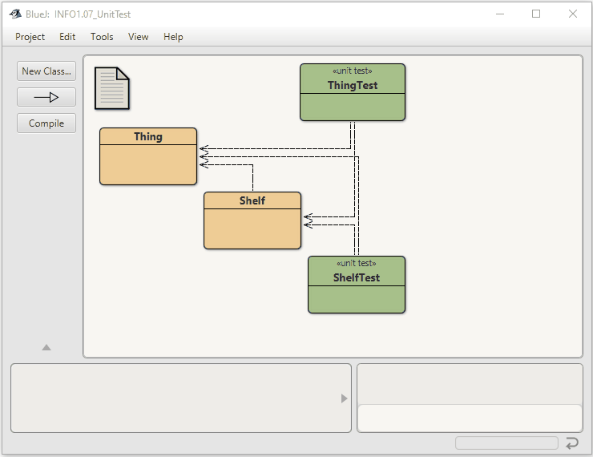

This project allows early prototyping of a new storage unit management project.
It demonstrates how JUnit-style unit test can be used for test support.
Furthermore, it is a first stept to train Test Driven Design.

Based on the original by David J. Barnes and Michael Kölling

@author n-c0de-r

@version 23.02.21

Many test fail, showing that there are still some things to fix.

